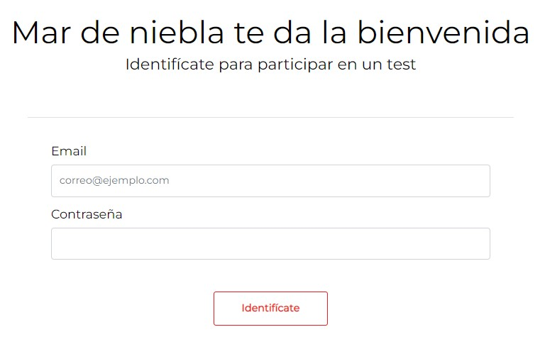
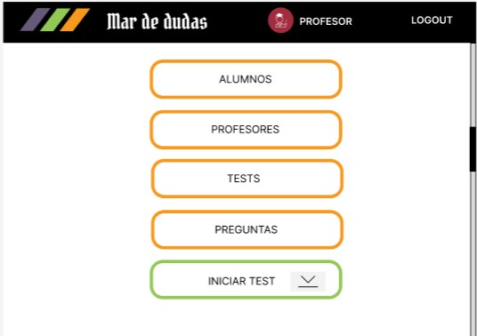
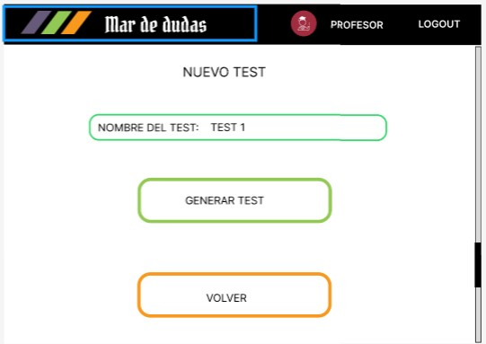
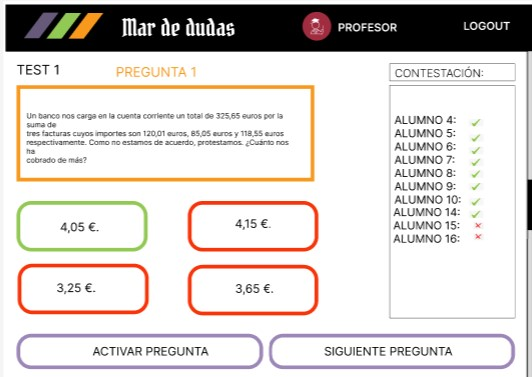

#  Mar de Dudas Project




*** 



*** 



***



***
# Description of the project Mar de Dudas

The Mar de Dudas project has been carried out to meet the needs of the Mar de Niebla Social Action Foundation, which needed an application in which teachers could offer their students knowledge control questionnaires, but they wanted to do it in a way that students could interact on each question.
The teacher sends a question that the students receive on their pc to answer it, then the teacher corrects and explains the correct answer and the students will not be able to see the next question until the teacher sends the next question again.

***
## General characteristics of the project:

There are two types of users: admin and user, the admins will be the teachers and the users will be the students.
Teachers will be able to: create questions, create users, create random tests, see all the generated tests, send the questions of each test to the students, see the final statistics of said test.

***
## Enlaces del proyecto:

### Front End: 
https://github.com/Crazy-House-Team/MarNieblaFront


### Back End: 
https://github.com/Crazy-House-Team/MarNieblaBack


***
### Jira: 

Board: https://quintomilenio.atlassian.net/jira/software/projects/MDN/boards/5

Roadmap: https://quintomilenio.atlassian.net/jira/software/projects/MDN/boards/5/roadmap


***
### Figma:
https://www.figma.com/file/afgFT1XE7uLomjNMwEis0k/Mar-de-Niebla?node-id=1%3A4


***
### Dailies: 
https://docs.google.com/document/d/1KFy8GcioTqvkMKUMzWIs_8IQkCmEZF9OzD11M5AtNoo/edit?usp=sharing


***
## Technical Requirements:

- Vue3
- PHP 8.1.6
- Bootstrap 5.2.1
- Composer 2.3.10
- Laravel


***
## Link, Cloning and Installation of our repository:

***
### Front End Link: 

https://github.com/Crazy-House-Team/MarNieblaFront

***
### Clone Front End:

git clone https://github.com/Crazy-House-Team/MarNieblaFront.git

- Go to project directory
- cd MarNieblaFront

***
#### Installation

- Install dependencies
- composer update
- Import the following file into XAMPP:  mardeniebla.sql
- Start the server
- run Apache and MySQL server in XAMPP

***
### Back End Link:
https://github.com/Crazy-House-Team/MarNieblaBack

***
### Clone Back End:
git clone https://github.com/Crazy-House-Team/MarNieblaBack.git

- Go to project directory
- cd MarNieblaBack

***
#### Installation

- Install dependencies
- composer update
- npm install
- run Apache and MySQL server in XAMPP
- npm run dev
- Start the server: php artisan serve
- Import the following file into XAMPP:  mardeniebla.sql
- php artisan migrate: fresh --seed
- run Apache and MySQL server in XAMPP


***

This template should help get you started developing with Vue 3 in Vite.

## Recommended IDE Setup

[VSCode](https://code.visualstudio.com/) + [Volar](https://marketplace.visualstudio.com/items?itemName=Vue.volar) (and disable Vetur) + [TypeScript Vue Plugin (Volar)](https://marketplace.visualstudio.com/items?itemName=Vue.vscode-typescript-vue-plugin).

## Customize configuration

See [Vite Configuration Reference](https://vitejs.dev/config/).

## Project Setup
```sh
npm install
```
### Compile and Hot-Reload for Development
```sh
npm run dev
```
### Compile and Minify for Production
```sh
npm run build
```
### Run Unit Tests with [Vitest](https://vitest.dev/)
```sh
npm run test:unit
```
### Lint with [ESLint](https://eslint.org/)
```sh
npm run lint
```

***
## Work methodology used:
- TDD
- Agile
- Scrum
- Pair programming

***
## Used Tools:

- HTML
- Css   
- JavaScript
- Vue 3
- Laravel 
- Bootstrap 5
- Php 8
- Figma 
- Jira
- Git Hub
- Visual studio code 
- MySQL Workbench
- Draw

***
## Used Fonts 

- Montserrat', Helvetica, Arial, sans-serif;

***
## Project Created by The Crazy House Team during the Factoría F5 Bootcamp 2022

***
## The Crazy House Team Contact

- Fran: gimli22@gmail.com
- Susana: asturias.susi.pro@gmail.com
- Sergio: sr.sergiofernandezfernandez@gmail.com
- Bea: btrabanco@gmail.com
- Mario: marioastur@gmail.com
- Dani: danimartinjuarez@gmail.com


