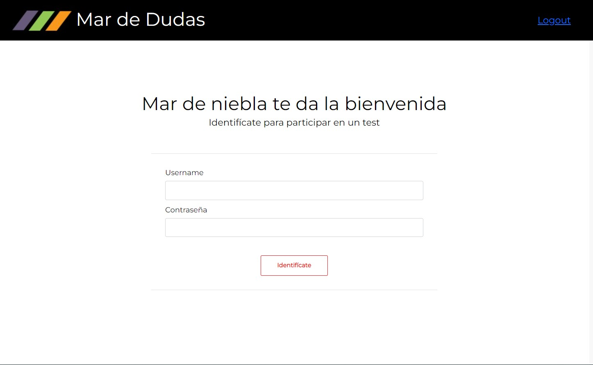
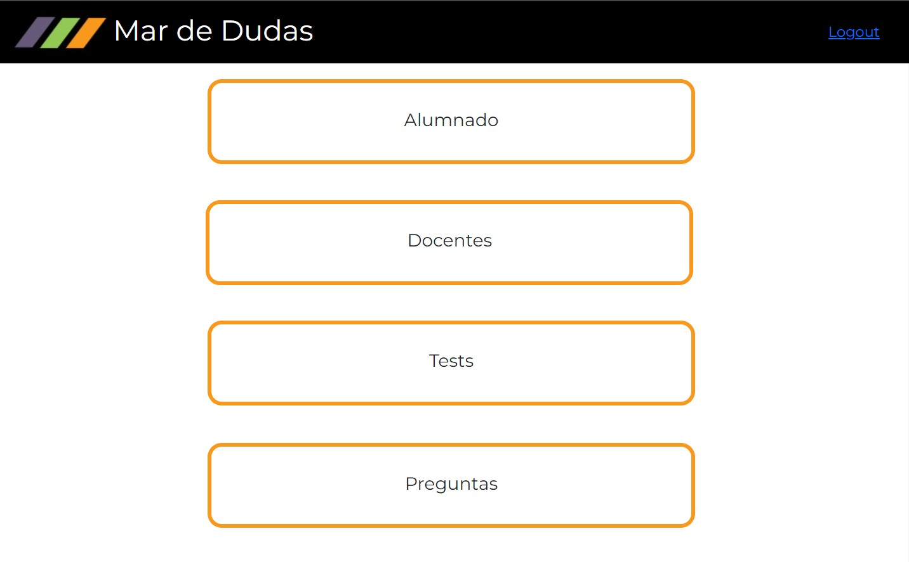
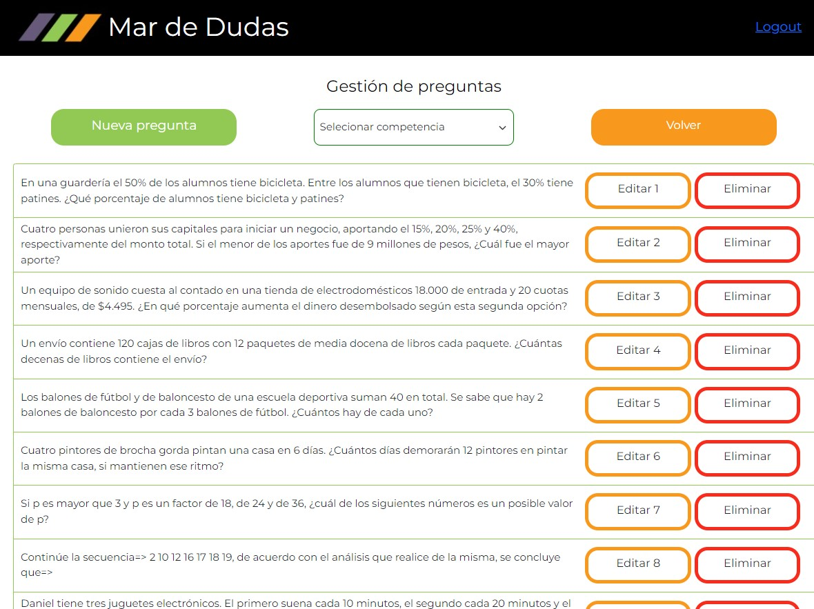

<h1 align="center" font="blond"> Mar de Dudas Project</h1>

# Description of the project Mar de Dudas

The Mar de Dudas project has been carried out to meet the needs of the Mar de Niebla Social Action Foundation, which needed an application in which teachers could offer their students knowledge control questionnaires, but they wanted to do it in a way that students could interact on each question.
The teacher sends a question that the students receive on their pc to answer it, then the teacher corrects and explains the correct answer and the students will not be able to see the next question until the teacher sends the next question again.

<div align="center">
<p> Page Login </p></div>

<div align="center">
<p> Page Admin </p></div>

<div align="center">
<p> Page Questions </p></div>

<div align="center">
<p> Page New Question </p></div>

# Functional requirements

<ul>
<li>There are two user options:
  <ol>Administrator: will be the teachers.</ol>
  <ol>Users: will be the students.</ol>
</li>
<li>As a teacher, you will generate an exam of 20 random questions taken from the database.</li>
<li>The teacher throws the first question and all the students in the class receive the question and the 4 answers on their screen, so they can select the answer.</li>
<li>The teacher will receive on his screen a statistic of who has answered which question and which was correct.</li>
<li>The teacher will move on to the next question when he decides.</li>
<li>At the end of the exam, the results of each student will be registered in the database, to be able to follow up.</li>
</ul>

# Technical requirements
<ul>
<li>How Admin could do the CRUD for the questions (the question, 4 possible answers, 1 correct)</li>
<li>As a teacher, you will register the students (CRUD), in the app.</li>
<li>As a teacher, you will generate an exam of 20 random questions taken from the database.</li>
<li>Good software development practices.</li>
</ul>

# Design Explanation:
The app has several views with different options, a simple design has been chosen for a basic application, using the Mar de Niebla color palette and logo.

# Technical and used tools

 <div align="center">
  
  
  
  
  
</div>
<div align="center">

  
  
   
</div>
<div align="center">
      
    
    
  
  
</div>


# How to run the project locally?
## Link, Cloning and Installation of our repository:
Clone the project :


```bash
Front End: 
https://github.com/Crazy-House-Team/MarNieblaFront
```
```bash
Back End: 
https://github.com/Crazy-House-Team/MarNieblaBack
```


## Other project links:
<ul>

Figma:
https://www.figma.com/file/afgFT1XE7uLomjNMwEis0k/Mar-de-Niebla?node-id=1%3A4

Jira: 
- Board: https://quintomilenio.atlassian.net/jira/software/projects/MDN/boards/5
- Roadmap: https://quintomilenio.atlassian.net/jira/software/projects/MDN/boards/5/roadmap

Dailies:
https://docs.google.com/document/d/1KFy8GcioTqvkMKUMzWIs_8IQkCmEZF9OzD11M5AtNoo/edit?usp=sharing

</ul>

***
## Installation

Enter the project directory in the terminal and execute the following command:
```bash
php artisan migrate:fresh --seed
```
This will update our database.
**We will need to run this command every time we make changes to the project database.**


Install dependencies:
```bash
composer update
```
```bash
npm install
```
Import the following file into XAMPP: 
```bash
mardeniebla.sql
```
Start the server
```bash
npm run dev
```

***
## Recommended IDE Setup

[VSCode](https://code.visualstudio.com/) + [Volar](https://marketplace.visualstudio.com/items?itemName=Vue.volar) (and disable Vetur) + [TypeScript Vue Plugin (Volar)](https://marketplace.visualstudio.com/items?itemName=Vue.vscode-typescript-vue-plugin).

## Customize configuration

See [Vite Configuration Reference](https://vitejs.dev/config/).

## Project Setup
```sh
npm install
```
### Compile and Hot-Reload for Development
```sh
npm run dev
```
### Compile and Minify for Production
```sh
npm run build
```
### Run Unit Tests with [Vitest](https://vitest.dev/)
```sh
npm run test:unit
```
### Lint with [ESLint](https://eslint.org/)
```sh
npm run lint
```
***
## Project Created by The Crazy House Team during the Factoría F5 Bootcamp 2022

***
## The Crazy House Team Contact

- Fran: gimli22@gmail.com
- Susana: asturias.susi.pro@gmail.com
- Sergio: sr.sergiofernandezfernandez@gmail.com
- Bea: btrabanco@gmail.com
- Mario: marioastur@gmail.com
- Dani: danimartinjuarez@gmail.com